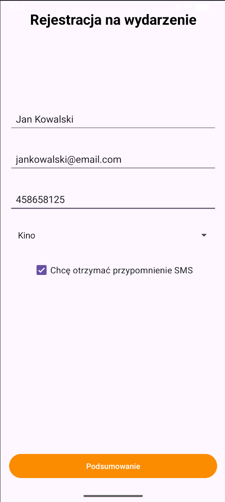
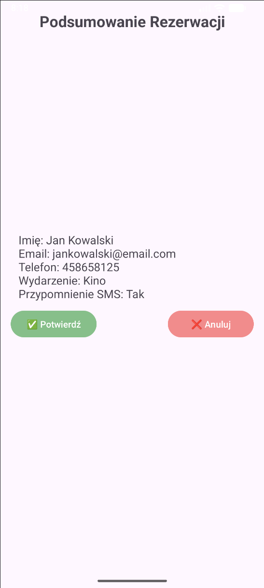

# Rejestracja na wydarzenie

## Opis projektu
Aplikacja Android w Javie umożliwiająca rejestrację na wybrane wydarzenie.  
Projekt demonstruje umiejętności:

- Przesyłania danych między aktywnościami (`Intent` – extras)  
- Walidacji danych w formularzu (puste pola, poprawny format e-mail i numeru telefonu)  
- Odbierania wyniku z drugiej aktywności (`SummaryActivity`)  
- Wyświetlania czytelnego podsumowania danych  

---

## Struktura aplikacji
1. **MainActivity** – formularz rejestracji  
   - Pola tekstowe (`EditText`) do wpisania: imię i nazwisko, adres e-mail, numer telefonu  
   - Spinner do wyboru wydarzenia 
   - CheckBox – opcjonalne przypomnienie SMS  
   - Przycisk **Podsumowanie**  

2. **SummaryActivity** – podsumowanie danych  
   - Wyświetlenie danych w czytelnym formacie w `TextView`  
   - Dwa przyciski:  
     - **Potwierdź** – zwraca `RESULT_OK`  
     - **Anuluj** – zwraca `RESULT_CANCELED`  

---

## Funkcjonalności

### MainActivity
- Walidacja pól formularza:  
  - Imię i nazwisko niepuste  
  - Email poprawny i niepusty  
  - Numer telefonu tylko cyfry, długość 9–15 znaków  
  - Spinner wymaga wyboru opcji nie może być pozostawiony placeholder `Wybierz wydarzenie`  

### SummaryActivity
- Odbiór danych z MainActivity (`getIntent().getStringExtra()` i `getBooleanExtra()`)  
- Wyświetlenie podsumowania: imię, email, telefon, wydarzenie, przypomnienie SMS  
- Przycisk **Potwierdź** – `RESULT_OK`  
- Przycisk **Anuluj** – `RESULT_CANCELED`  

### Odbiór wyniku w MainActivity
- Metoda `onActivityResult()` rozróżnia `RESULT_OK` i `RESULT_CANCELED`  
- Wyświetla komunikat `Toast` informujący o wyniku rejestracji  

---

## Zrzuty ekranu

### MainActivity – formularz

### SummaryActivity – podsumowanie

